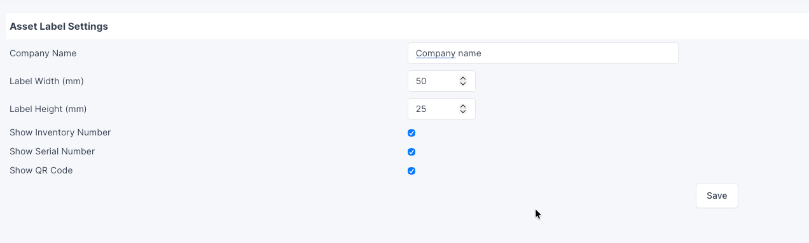
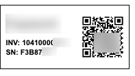

# GLPI Asset Label

Simple GLPI 11 plugin for printing configurable asset labels with QR codes.

## Screenshots

### Settings

### Asset Label

## Features

- Adds an Asset Label tab to computer assets
- Prints configurable asset labels
- Configurable company name
- Configurable label size
- Optional inventory number
- Optional serial number
- Optional QR code linking directly to the asset card

## Requirements

- GLPI 11.x

## Installation

1. Copy the plugin to:

   glpi/plugins/computerlabel

2. Install and enable the plugin from Setup → Plugins
3. Open plugin settings and configure label options
4. Open any computer asset and select Asset Label

## Tested with

- GLPI 11.0.6

## License

GPL v2+

## Author

Andrey Sennikov
